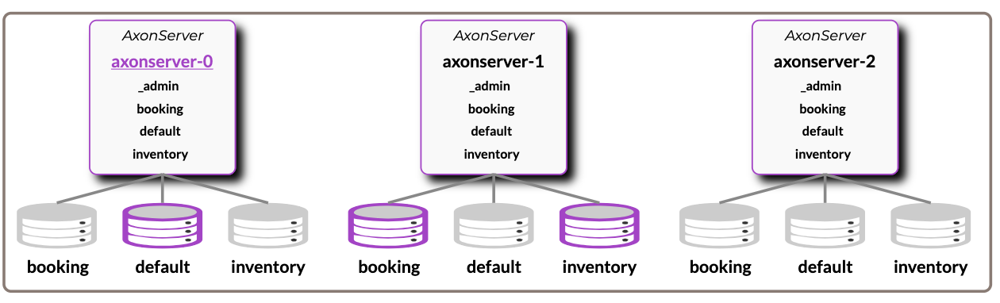
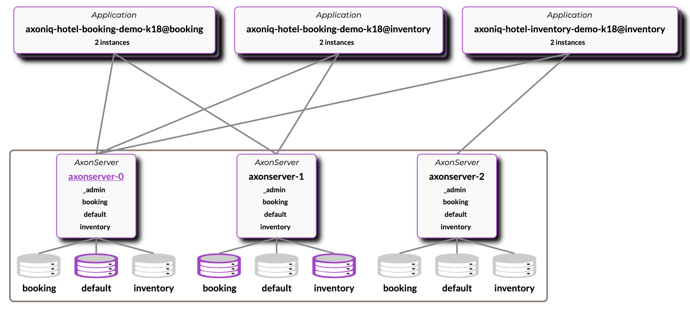
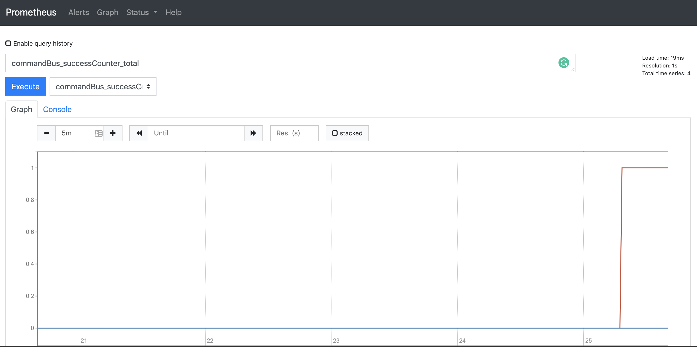
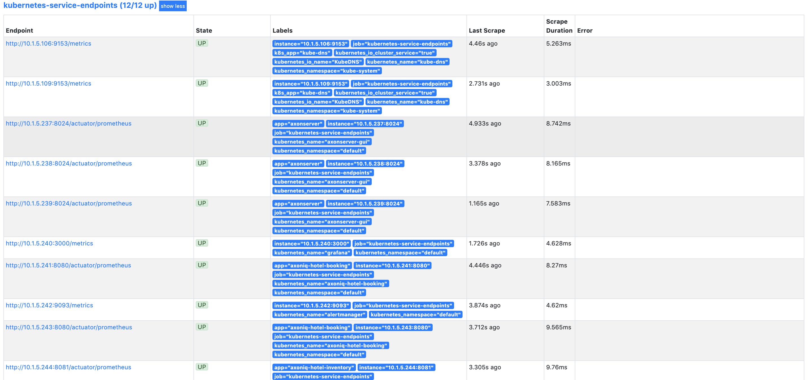
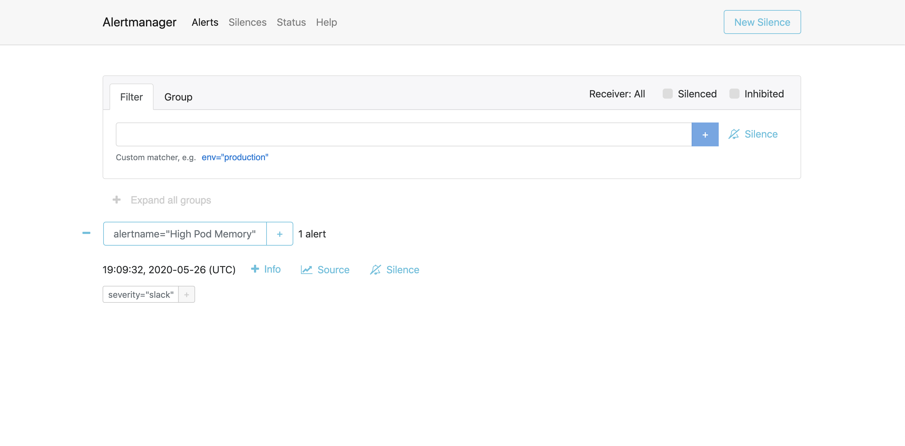
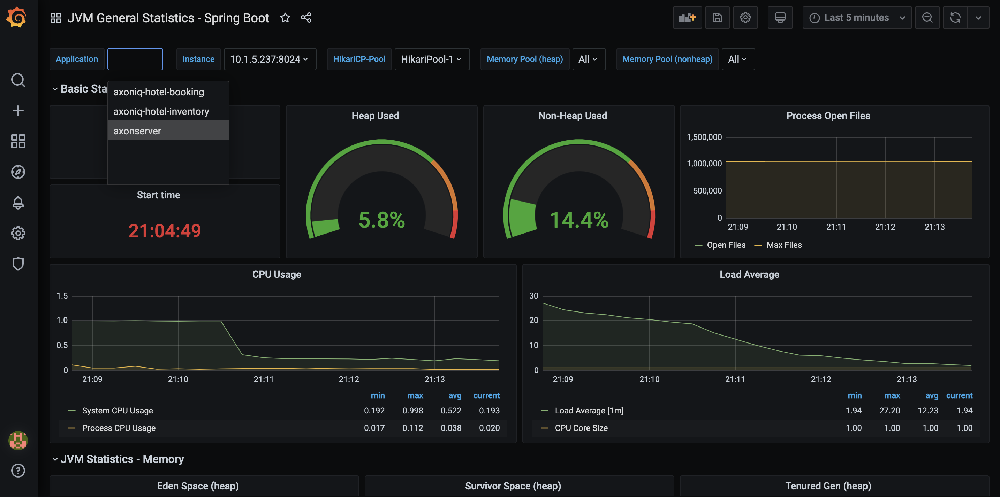
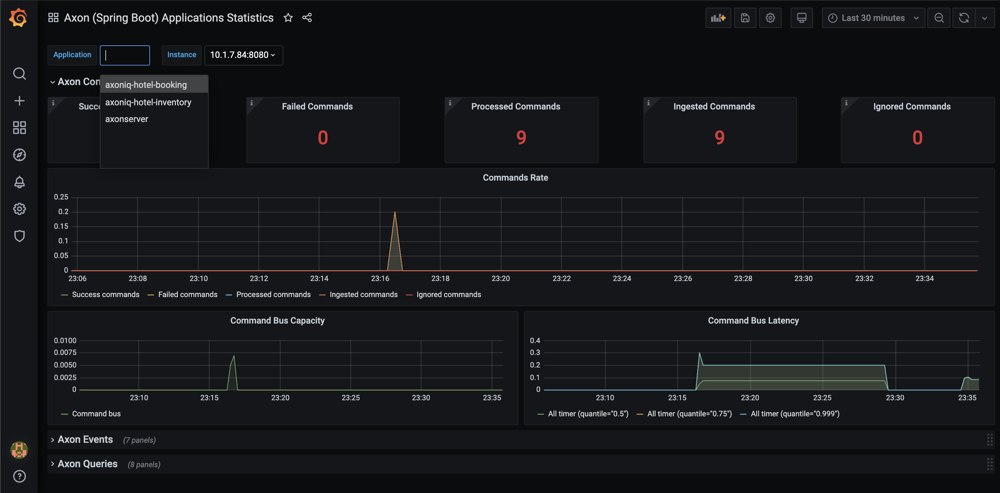
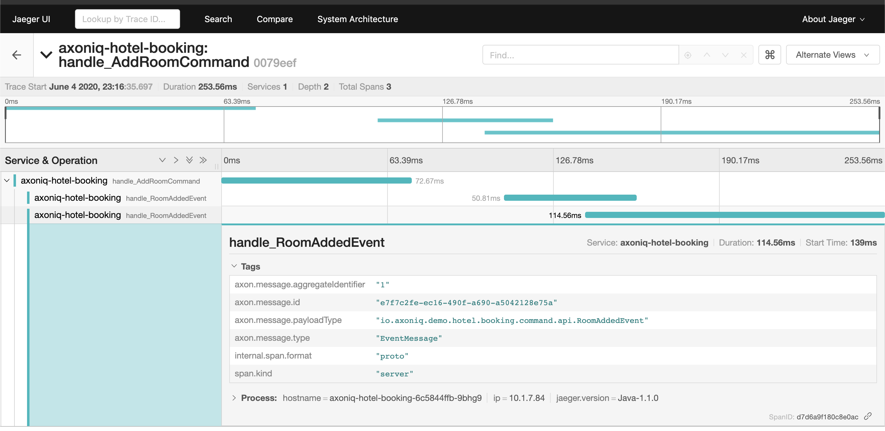

# Kubernetes deployment

Deployment on Kubernetes (CaaS), with [kustomize](https://github.com/kubernetes-sigs/kustomize).

All Kustomize does is merge various YAML files into one.

We will have three environments:

- `Base`: contains a set of YAML configuration on which other environments can be based on
- `Standard`: extends base, will add AxonServer SE ...
- `Enterprise`: extends base, will add AxonServer EE ...

## Build application and Docker image to local Docker Daemon

[Jib](https://github.com/GoogleContainerTools/jib) builds optimized Docker and OCI images for your Java applications without a Docker daemon

```bash
mvn clean verify jib:dockerBuild
```

[Kustomize](https://kubernetes.io/docs/tasks/manage-kubernetes-objects/kustomization/#overview-of-kustomize) is a tool for customizing Kubernetes configurations. It is part of the `kubectl`.


### MicroK8s
When running MicroK8s under Ubuntu Snap, the docker images built by jib are not directly available to Kubernetes. You can import the images to the MicroK8s distribution, using the following commands:

```bash
cd /tmp
docker save axoniq-hotel-booking > axoniq-hotel-booking.tar
docker save axoniq-hotel-inventory > axoniq-hotel-inventory.tar
microk8s ctr image import axoniq-hotel-booking.tar
microk8s ctr image import axoniq-hotel-inventory.tar
```

## Apply `Standard` configuration

You can run the following command to start your application(s) with `standard` (Axon Server SE) edition:

```bash
kubectl apply -k .k8s/overlays/standard/
```

- Axon Server Dashboard: [http://localhost:8024](http://localhost:8024)
- Prometheus: [http://localhost:30000](http://localhost:30000)
- Alert manager: [http://localhost:31000](http://localhost:31000)
- Grafana: [http://localhost:32000](http://localhost:32000) (username: admin, password: admin)
- Booking application: [http://localhost:8080](http://localhost:8080)
- Inventory application: [http://localhost:8081](http://localhost:8081)

#### Delete `Standard` configuration

```bash
kubectl delete -k .k8s/overlays/standard/
kubectl delete pvc --all
```

## Apply `Enterprise` configuration

**Make sure you have correct license file configured in [.k8s/overlays/enterprise/axonserver/axonserver-enterprise-secret.yml](.k8s/overlays/enterprise/axonserver/axonserver-enterprise-secret.yml)**

Make sure you have access to AxonIQ docker registry:

```bash
gcloud auth configure-docker
docker pull eu.gcr.io/axoniq-devops/axonserver-enterprise:4.4.7
```

You can run the following command to start Axon Server EE edition:

### Axon Server

```bash
kubectl apply -k .k8s/overlays/enterprise/axonserver
```

Additionally, you have to forward the port 8024 for the GUI service:

```shell script
kubectl port-forward service/axonserver-gui 8024:8024
```

Axon Server Dashboard: [http://localhost:8024](http://localhost:8024) (username: `admin` ; password: `admin`)



> Once AxonServer is running and ready, start the applications:

### Applications

You can run the following command to start your application(s) with `enterprise` (Axon Server EE) edition:

```bash
kubectl apply -k .k8s/overlays/enterprise/applications
```

- Booking application: [http://localhost:8080](http://localhost:8080)
- Inventory application: [http://localhost:8081](http://localhost:8081)



### Prometheus

- Prometheus: [http://localhost:30000](http://localhost:30000)




### Alert manager

- Alertmanager: [http://localhost:31000](http://localhost:31000)



### Grafana

- Grafana: [http://localhost:32000](http://localhost:32000) (username: admin, password: admin)

#### General Spring Boot Dashboard



#### General Axon (Spring Boot) Dashboard



### Jaeger (tracing)

- Jaeger: [http://localhost:32100](http://localhost:32100)



#### Delete `Enterprise` configuration

```bash
kubectl delete -k .k8s/overlays/enterprise/axonserver/
kubectl delete -k .k8s/overlays/enterprise/applications/
kubectl delete pvc --all
```
