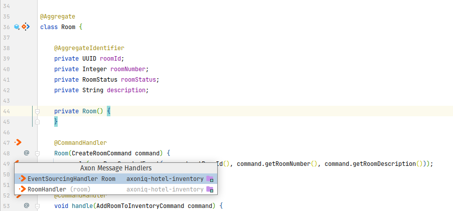
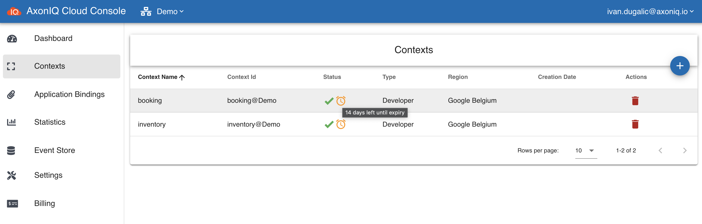
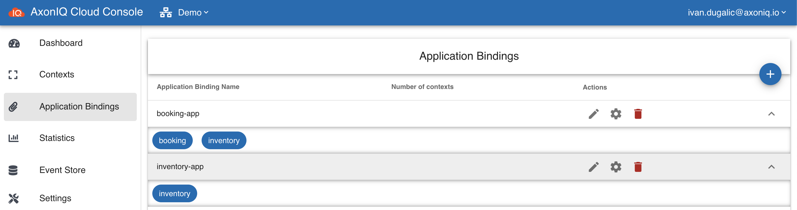
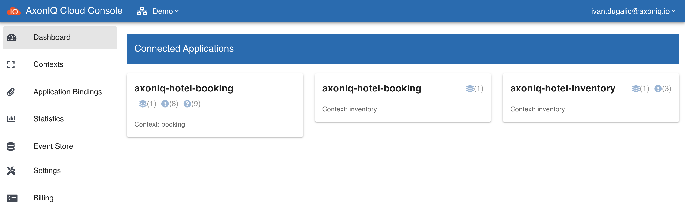

# AxonIQ hotel demo

It's the implementation of the example used in this blog post: [https://eventmodeling.org/posts/what-is-event-modeling/](https://eventmodeling.org/posts/what-is-event-modeling)

Event modeling adopts Event Storming sticky notes. The final piece was the UI/UX aspects to complete what more resembles a movie story board (white board - or digital white board). While Event Storming focuses in discovering the problem space, Event Modeling creates a blueprint for a solution.

[Download specification (Demo.pdf)](Demo.pdf)

The Miro board is [publicly available (view only)](https://miro.com/app/board/o9J_kuZkBh8=/) as well. 

## Prerequisites

- Java 11

## Recommendations
Installing the [Axon Framework IntelliJ plugin](https://plugins.jetbrains.com/plugin/18628-axon-framework) will help you visualize the application's publishers and handlers. 
You can easily install this by going to the Marketplace in your IntelliJ plugin settings. 



## Running the application(s) locally

**Requirements**

> You can [download](https://download.axoniq.io/axonserver/AxonServer.zip) a ZIP file with AxonServer as a standalone JAR. This will also give you the AxonServer CLI and information on how to run and configure the server.
>
> Alternatively, you can run the following command to start AxonServer in a Docker container:
>
> ```
> docker run -d --name axonserver -p 8024:8024 -p 8124:8124 axoniq/axonserver
> ```

```shell script
mvn clean verify
```

### Booking

```shell script
cd booking/
mvn spring-boot:run
```

- UI: [http://localhost:8080](http://localhost:8080)
- RSocket [readme](booking/README.md)

### Inventory

```shell script
cd inventory/
mvn spring-boot:run
```

- UI: [http://localhost:8081](http://localhost:8081)

### Using [AxonIQ Cloud](https://cloud.axoniq.io/)

- Create your account (you can select free Developer account option) [https://cloud.axoniq.io/](https://cloud.axoniq.io/)
- Create `booking` and `inventory` contexts
- 
- Create application bindings (make sure that `booking` application can access both contexts, `booking` and `inventory`)
- 
- Copy the configuration settings into [booking/../application-cloud.properties](booking/src/main/resources/application-cloud.properties) and [inventory/../application-cloud.properties](inventory/src/main/resources/application-cloud.properties).
- Check the [Java configuration](booking/src/main/java/io/axoniq/demo/hotel/booking/command/config/BookingCommandCloudConfiguration.java) to make sure the context names are matching.
- Run the `booking` application (`cd booking`): `mvn spring-boot:run -Dspring-boot.run.profiles=cloud`
- Run the `inventory` application (`cd inventory`): `mvn spring-boot:run -Dspring-boot.run.profiles=cloud`
- 
- Access the local `booking` application in the web browser `http://localhost:8080/`
- Access the local `inventory` application in the web browser `http://localhost:8081/`

## Running all on Kubernetes

Deployment on Kubernetes (CaaS) is documented in [.k8s/Readme.md](./.k8s/README.md).
It demonstrates the usage of Axon Server Standard Edition and Axon Server Enterprise Edition in a multi-context setup with access control enabled. If you want to actually run Axon Server Enterprise Edition you need a valid license file.

---

Created with :heart: by [AxonIQ](http://axoniq.io)

[axon]: https://axoniq.io/
